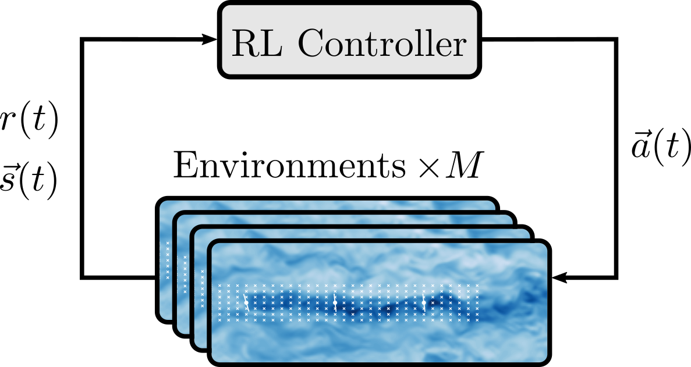
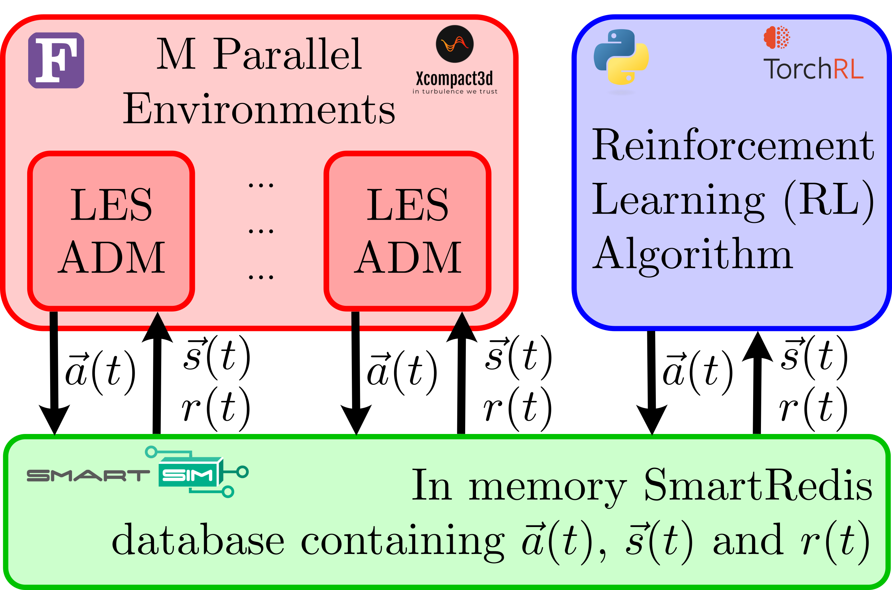

# Wind-RL
## Reinforcement Learning for Active Wind Farm Control

This repository contains code that integrates reinforcement learning with wind farm simulations to develop an active wake steering control strategy. Wake steering aims to optimise turbine yaw angles to redirect wakes and maximise the overall power production of the wind farm.

Our approach uses reinforcement learning to train control policies that adapt dynamically to varying wind conditions. By coupling an RL controller with a high-fidelity wind farm simulation environment, this framework learns optimal wake control strategies that dynamically adjust based on the wind conditions and increases the power output of the wind farm.

<p align="center">



</p>

## How to install

Smartsim is used to interface the RL code here with wind farm environments simulated using [Xcompact3d](https://www.incompact3d.com/).


### Xcompact3d-SmartRedis Installation

A [modified version Incompact3d](https://github.com/admole/Incompact3d/tree/smartRedis-coupling) is needed for running the windfarm simulations with SmartRedis integration.

On Archer2
```bash
module swap PrgEnv-cray PrgEnv-gnu
module load cmake/3.21.3
cd work/<PROJECTCODE>/<PROJECTCODE>/<USERNAME>
git clone https://github.com/admole/Incompact3d.git
cd Incompact3d
sed -i 's|install/lib|install/lib64|g' cmake/FindSmartRedis.cmake
export FC=mpif90
cmake -S . -B build
cmake --build ./build -j 8
```

### Python Requirements

These instructions will get SmartSim installed together with TorchRL:

0. If on Archer2 load python module and setup venv for packages
```bash
module load PrgEnv-gnu
module load cray-python
python -m venv --system-site-packages /work/<PROJECTCODE>/<PROJECTCODE>/<USERNAME>/smartsim_venv
source /work/<PROJECTCODE>/<PROJECTCODE>/<USERNAME>/smartsim_venv/bin/activate
```

1. Install torchrl with
```bash
pip install torchrl==0.2.1
```

2. Install the correct version of tensordict with 
```bash
pip uninstall tensordict
pip install tensordict==0.2.0
```

3. Uninstall the PyTorch build with
```bash
pip uninstall torch
```

4. Build SmartSim, requesting PyTorch as an ML backend (On Archer2 also need to install git-lfs before this step)
```bash
pip install smartsim==0.7.0
smart build --device cpu --no_tf
```
This will install torch 2.0.1 (CPU only).

5. Install the remaining requirements by running
```bash
pip install tqdm matplotlib hydra-core wandb f90nml
```

6. Install Numpy 1.x for compatability
```bash
pip install numpy==1.26.4
```

Happy times.


## Running

The launch scripts can be used to launch RL training, BO runs and evaluation runs.
For example to run an SAC RL training run: 

```bash
SR_LOG_FILE=./log.sr
SR_LOG_LEVEL=QUIET
python launch_sac_run.py
```

When running on HPC (ARCHER2) a submission script can be used:

### Running on Archer
Launch with submission script

```bash
sbatch submit_sac.sh
```

To change parameters either modify the relevent config files or override the config with: eg.

```bash
python launch_sac_run.py <case_name> env.turbines=10
```


## Database Coupling Procedure

### Python

``` 
send i_sim_done = False
send i_yaws_done = False
for(frame = 0; frame < episode_length; frame += frameskip)
	calculate yaws
	send i_yaws = yaws
	send i_yaws_done = True
	while(i_sim_done == False):
		read i_sim_done
		continue
	read reward, observation
	send i_sim_done = False
```

### Fortran

```
for(frame = 0; frame < episode_length; frame += frameskip)
	while(i_yaws_done == False): 
		read i_yaws_done 
		continue 
	read i_yaws 
	send i_yaws_done = False 
	simulate frameskip timesteps with yaws
	calculate reward, observation
	send i_turbine_powers, i_probe_data = reward, observation 
	send i_sim_done = True
```

### Database content

For each environment $i \in \{0, \dots, m-1\}$   

| Name + Data type                                | Description                                                              |
| ----------------------------------------------- | ------------------------------------------------------------------------ |
| `i_yaws[nTurbines] double`                      | Turbine angles generated by Python                                       |
| `i_yaws_done int`                               | Python has generated new angles (0 = False, 1 = True)                    |
| `i_sim_done int`                                | xCompact3D has completed simulation of `frameskip` (0 = False, 1 = True) |
| `i_turbine_powers[nTurbines] double`            | Reward: power generated by each turbine                                  |
| `i_probe_data[nTurbines][obsPerTurbine] double` | Observations                                                             |
